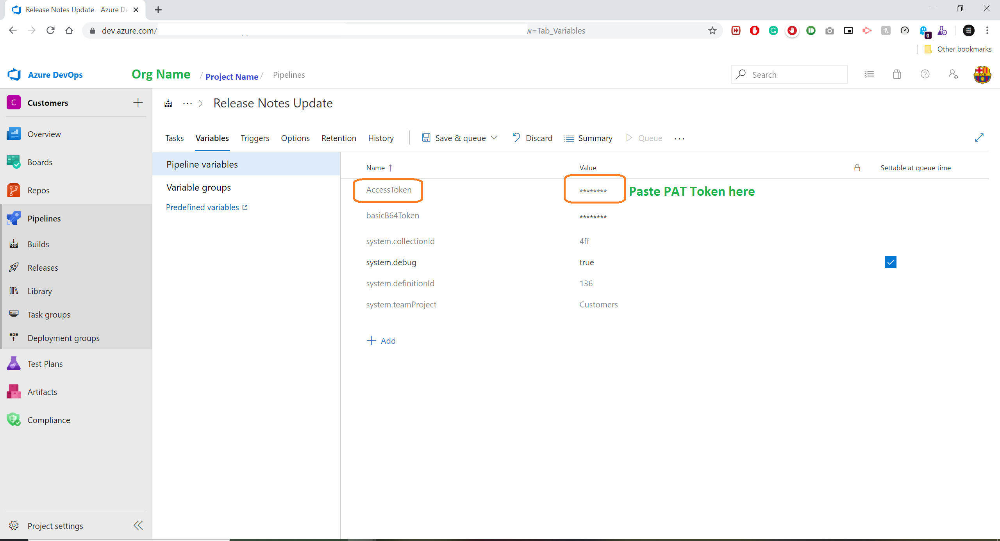
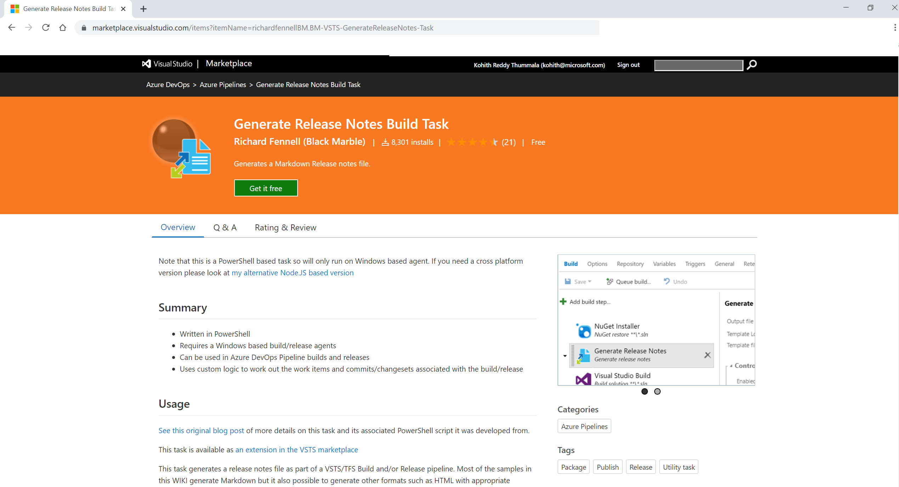
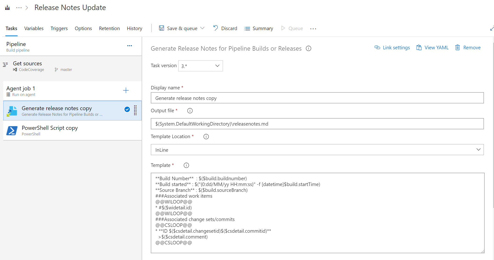
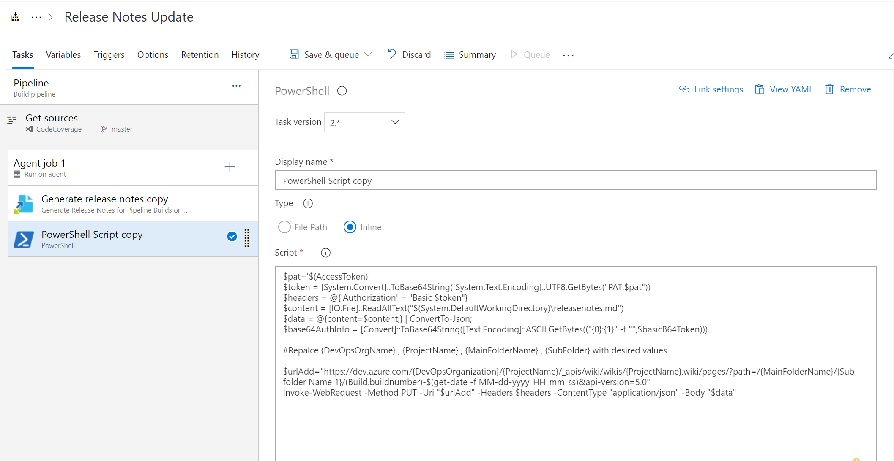

# Automatically Update Release Notes in the Azure DevOps Wiki pages
## prerequisite 

- Create a Azure DevOps Organization.
  - Reference link: https://docs.microsoft.com/en-us/azure/devops/organizations/accounts/create-organization?view=azure-devops
- Create a devops project
  - Reference link: https://docs.microsoft.com/en-us/azure/devops/organizations/projects/create-project?view=azure-devops
- Create a Personal Access Token in Azure DevOps organization. 
  - Refrence link: https://docs.microsoft.com/en-us/azure/devops/organizations/accounts/use-personal-access-tokens-to-authenticate?view=azure-devops
- Add "Access Token" variable in the Piepline Variable.

- Install "Generate Release Notes Build Task" Extension from Visual Studio MArket place
  - Reference Link: https://marketplace.visualstudio.com/items?itemName=richardfennellBM.BM-VSTS-GenerateReleaseNotes-Task
- Add below template in the 
    
```html
<p>**Build Number**  : $($build.buildnumber)    
**Build started** : $("{0:dd/MM/yy HH:mm:ss}" -f [datetime]$build.startTime)     
**Source Branch** : $($build.sourceBranch)  
###Associated work items  
@@WILOOP@@  
* #$($widetail.id)
@@WILOOP@@  
###Associated change sets/commits  
@@CSLOOP@@  
* **ID $($csdetail.changesetid)$($csdetail.commitid)** 
  >$($csdetail.comment)    
@@CSLOOP@@
</p>
```

- Set "Output file" to "$(System.DefaultWorkingDirectory)\releasenotes.md"



- Add "Powershell Task" in the pipeline.
  - Reference Link : https://docs.microsoft.com/en-us/azure/devops/pipelines/tasks/utility/powershell?view=azure-devops
- Select "Inline" as Type in the task configuration.
- Add the below inline code snippet.

```html
<p>$pat='$(AccessToken)'
$token = [System.Convert]::ToBase64String([System.Text.Encoding]::UTF8.GetBytes("PAT:$pat"))
$headers = @{'Authorization' = "Basic $token"}
$content = [IO.File]::ReadAllText("$(System.DefaultWorkingDirectory)\releasenotes.md")
$data = @{content=$content;} | ConvertTo-Json;
$base64AuthInfo = [Convert]::ToBase64String([Text.Encoding]::ASCII.GetBytes(("{0}:{1}" -f "",$basicB64Token)))

#Repalce {DevOpsOrgName} , {ProjectName} , {MainFolderName} , {SubFolder} with desired values

$urlAdd="https://dev.azure.com/{DevOpsOrganization}/{ProjectName}/_apis/wiki/wikis/{ProjectName}.wiki/pages/?path=/{MainFolderName}/{Sub folder Name 1}/(Build.buildnumber)-$(get-date -f MM-dd-yyyy_HH_mm_ss)&api-version=5.0"
Invoke-WebRequest -Method PUT -Uri "$urlAdd" -Headers $headers -ContentType "application/json" -Body "$data"

</p>
```
